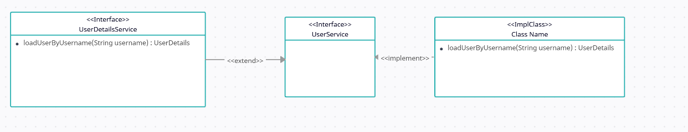
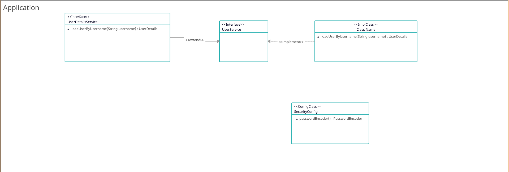

# Security-02-db-login

> 任务目标：将数据库中的用户名和密码，作为我们登录的用户名和密码，解决加密问题
>
> 注：我们的密码都是以**密文**的形式存储在数据库中，也就是说，从密码被创建的那一刻，除了用户，天王老子都不知道密码是什么，除非他知道我们用的是***BCryptPasswordEncoder*** 加密器。

## 具体实现思路

UserService去继承*`UserDetailsService`* 接口，让UserServiceImpl去实现UserService接口，复写 *`loadUserByUsername()`*  方法，封装一个*`UserDetails对象`* 返回给我们的Filter即可。




---


## 具体代码

> UserService

```java
package cn.believesun.service;

import org.springframework.security.core.userdetails.UserDetailsService;

public interface UserService extends UserDetailsService {
}
```


> UserServiceImpl

```java
package cn.believesun.service.impl;

import cn.believesun.mapper.TUserMapper;
import cn.believesun.pojo.TUser;
import cn.believesun.service.UserService;
import org.springframework.beans.factory.annotation.Autowired;
import org.springframework.security.core.authority.AuthorityUtils;
import org.springframework.security.core.userdetails.User;
import org.springframework.security.core.userdetails.UserDetails;
import org.springframework.security.core.userdetails.UsernameNotFoundException;
import org.springframework.stereotype.Service;

@Service
public class UserServiceImpl implements UserService {

    @Autowired
    private TUserMapper tUserMapper;

    @Override
    public UserDetails loadUserByUsername(String username) throws UsernameNotFoundException{
        TUser tUser = tUserMapper.selectUserByActNo(username);
        if(tUser == null){
            throw new UsernameNotFoundException("用户不存在");
        }
        // 这里使用了User类（注：这个User类是SpringSecurity自己提供的，而不是我们写的）的构造模式，从数据库中依照前端传来的名字
        // 进行查询，将查询到的 Account 对象，封装为一个UserDetails对象进行返回。
        UserDetails userDetails = User.builder()
                .username(tUser.getLoginAct())
                .password(tUser.getLoginPwd())
                .authorities(AuthorityUtils.NO_AUTHORITIES) // 空权限，EmptyList
                .build();
        return userDetails;
    }
}

```

### 配置密码加密器

如果不进行配置，则会出现以下报错：

```tex
java.lang.IllegalArgumentException: Given that there is no default password encoder configured, each password must have a password encoding prefix. Please either prefix this password with '{noop}' or set a default password encoder in `DelegatingPasswordEncoder`.
```

提示我们去配置一个密码加密器  password encoder，将Bean对象封装到IoC容器中。

> 这里不使用@Service注解将其纳入IoC容器中是因为，在Spring中规定，@Service...注解只标注我们自己写的Class，而对于官方写的类，则使用@Bean注解进行标注

```java
package cn.believesun.config;

import org.springframework.context.annotation.Bean;
import org.springframework.context.annotation.Configuration;
import org.springframework.security.crypto.bcrypt.BCryptPasswordEncoder;
import org.springframework.security.crypto.password.PasswordEncoder;

@Configuration
public class SecurityConfig {
    // 配置密码加密器，用于 SpringSecurity 去比较 UserDetails的实现类User的密码 与 用户输入的是否一致。
    @Bean
    public PasswordEncoder passwordEncoder(){
        return new BCryptPasswordEncoder();
    }
}
```

