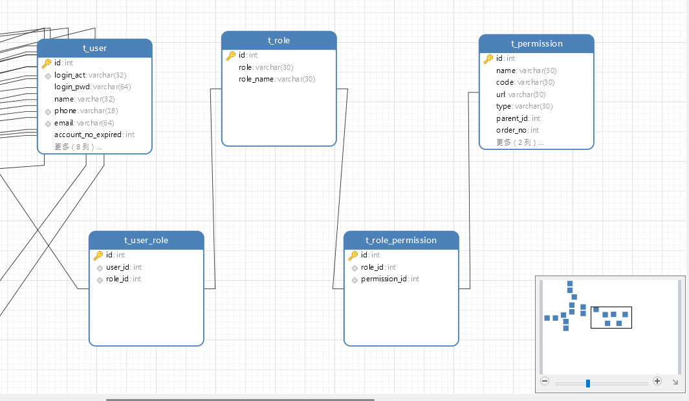
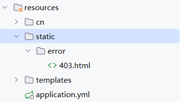

# SpringSecurity-06-role-permission

> 主要解决了不同角色对不同资源的访问权限。使用的思想是RBAC（Roles Based Access Control）基于角色的权限控制。

## 数据库准备

数据库由三张主表和两张辅表组成。囊括了一个用户的 ***个人信息 角色 资源权限***。以下为数据库表关系图。



可以通过`t_user`的`id `---> 根据`t_user_role` ---> 查询到对于的`t_role`，然后通过其`role`的`id`在`t_role_permission`中查询出`permission_id`，最后在`t_permissoin`中的URL中对应着他的权限

```sql
SELECT
	* 
FROM
	t_role 
WHERE
	t_role.id IN (
	SELECT
		t_user_role.role_id 
	FROM
		t_user
		JOIN t_user_role ON t_user.id = t_user_role.user_id 
WHERE
	t_user.id = #{userId})
```


---


## 实体类实现UserDetails

> 通过@Data注解生成tRoleList的set方法，在 `loadUserByUsername` 阶段就进行权限的设置。

```java
@Data
public class TUser implements Serializable, UserDetails {
    private List<TRole> tRoleList;

    @Override
    public Collection<? extends GrantedAuthority> getAuthorities() {
        // 配置RoleList
        if (this.tRoleList.isEmpty()) {
            return List.of();
        }
        // 封装role对象
        Collection<GrantedAuthority> authorities = new ArrayList<>();
        for(TRole tRole : tRoleList){
            authorities.add(new SimpleGrantedAuthority(tRole.getRole()));
        }
        return authorities;
    }
}
```

UserService类的修改

```java
@Service
public class UserServiceImpl implements UserService {

    @Autowired
    private TUserMapper tUserMapper;

    @Autowired
    private TRoleMapper tRoleMapper;
    @Override
    public UserDetails loadUserByUsername(String username) throws UsernameNotFoundException{
        // 使用自己的tUser对象
        TUser tUser = tUserMapper.selectUserByActNo(username);
        if(tUser == null){
            throw new UsernameNotFoundException("用户不存在");
        }
        // 从数据库中查询，给角色权限
        List<TRole> tRoleList = tRoleMapper.selectRolesByUserId(tUser.getId());
        tUser.setTRoleList(tRoleList);
        return tUser;
    }
}
```


---


## Controller类的准备

```java
@RestController
public class ClueController {
    /**
     * 线索管理
     * 线索管理
     * 线索管理-列表
     * 线索管理-录入
     * 线索管理-编辑
     * 线索管理-查看
     * 线索管理-导入
     */
    @GetMapping("/api/index")
    public String index() {
        return "index";
    }

    @GetMapping("/api/clue/menu")
    @PreAuthorize("hasAuthority('saler')") // 只有 saler 能访问
    public String clueMenu(){
        return "ClueMenu";
    }

    @GetMapping("/api/clue/child")
    @PreAuthorize("hasAnyAuthority('saler','admin')") // 只有 saler 和admin 能访问
    public String clueChild(){
        return "ClueChild";
    }

    @GetMapping("/api/list")
    @PreAuthorize("hasAuthority('admin')")
    public String clueList(){
        return "clueList";
    }
    // 剩下的不想写了，懂我意思就行......
}
```


---


- `hasRole()`方法和`hasAuthority()`使用方法

  - hasRole()方法中，使用时需要确保Bean对象的 `authorities` 集合存入的属性必须包含 `ROLE_` 开头的前缀

    - ```java
       @PreAuthorize("hasRole('admin')") // 代表你的数据必须包含 ROLE_admin 元素。
      ```


  - hasAuthority()方法，就是你存进去是啥，就填啥。

    - ```java
      @PreAuthorize("hasAuthority('admin')") // 数据中需要包含 admin 即可。
      ```

```java
@Override
public Collection<? extends GrantedAuthority> getAuthorities() {
    // 配置RoleList
    if (this.tRoleList.isEmpty()) {
        return List.of();
    }
    // 封装role对象
    Collection<GrantedAuthority> authorities = new ArrayList<>();
    for(TRole tRole : tRoleList){
        authorities.add(new SimpleGrantedAuthority(tRole.getRole()));
    }
    return authorities;
}
```

详细设置：

- 如果你在Controller中使用***@PerAuthrize("<font color=red>hasRole('key')</font>")***

​	那么那就必须在`getAuthorities()` 中使用 `authorities.add(new SimpleGrantedAuthority("ROLE_"+tRole.getRole()));`

- 如果你使用的时***@PerAuthrize("<font color=red>hasAuthority('key')</font>")***

​	那么就只必须在`getAuthorities()` 中使用 `authorities.add(new SimpleGrantedAuthority(tRole.getRole()));`即可


---


## 自定义权限不足页面（403页面）

很简单，只需要在resource/static 下创建 error目录，然后创建 403.html 文件即可。



